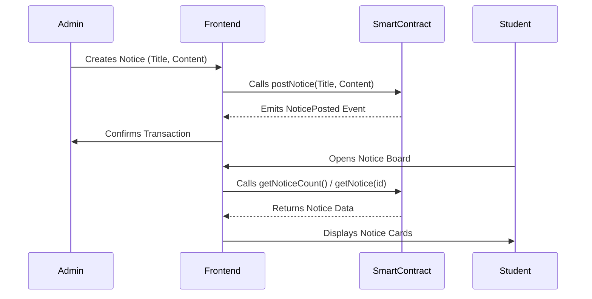

# System Architecture

## Overview
BlockNotice is a decentralized application (dApp) that allows for the issuance and verification of official notices using blockchain technology. The system ensures that notices are immutable, transparent, and verifiable.

## Components

### 1. Frontend (Client)
- **Technology**: React, Vite, Tailwind CSS, Ethers.js.
- **Role**: Provides the user interface for students to view notices and for administrators to publish them.
- **Interaction**: Connects to the Ethereum blockchain via MetaMask (injected Web3 provider).

### 2. Smart Contract (Blockchain)
- **Technology**: Solidity (Ethereum).
- **Role**: Acts as the immutable ledger. Stores notice metadata (ID, Title, Timestamp, Author, Content/Hash).
- **Deployment**: Local Hardhat network or public testnets (Sepolia, Goerli).

### 3. IPFS (Conceptual/Future)
- **Role**: Decentralized storage for large notice content (files, images, full text).
- **Flow**: The frontend would hash the content, upload to IPFS, and store only the IPFS Hash on the blockchain to save gas.

## Data Flow

## Security
- **Admin Access**: Currently, the logic allows anyone to post in the demo contract, but a production version would restrict `postNotice` to the contract owner or whitelisted addresses.
- **Immutability**: Once a notice is mined on the blockchain, it cannot be altered or deleted.
